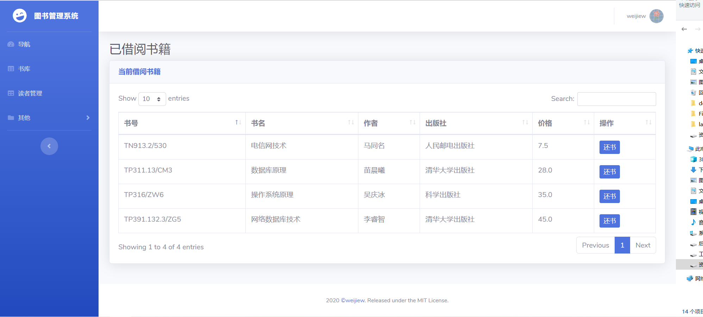
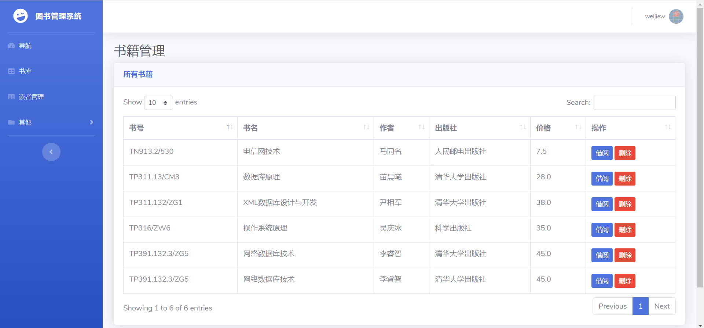
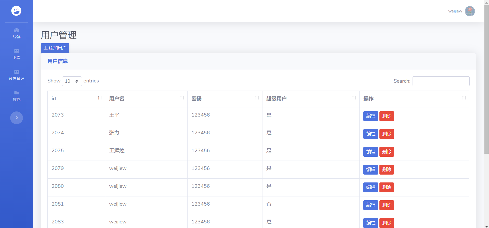
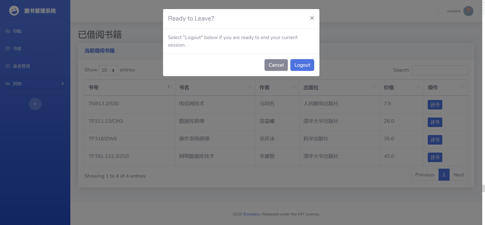

## 图书管理系统

数据库结课作业，图书管理系统，前前后后花了一个星期，现在还存在一些 BUG 。

这个[视频](https://www.bilibili.com/video/BV1PE411i7CV?from=search&seid=16638383268754863480)对我的帮助很大。

## 技术栈

* 后端：Spring Boot
* 前端： thymeleaf
* 数据库： SQL server 2008 （虽然我很想用 mysql ，但是这门课是按照 sql server 2008 来教的）

## 部分展示

